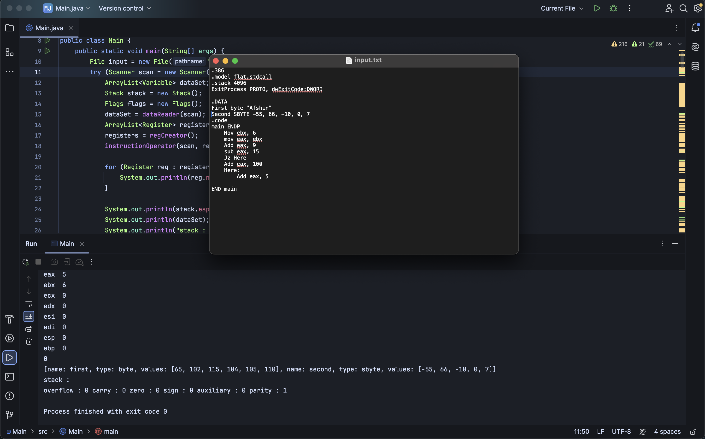
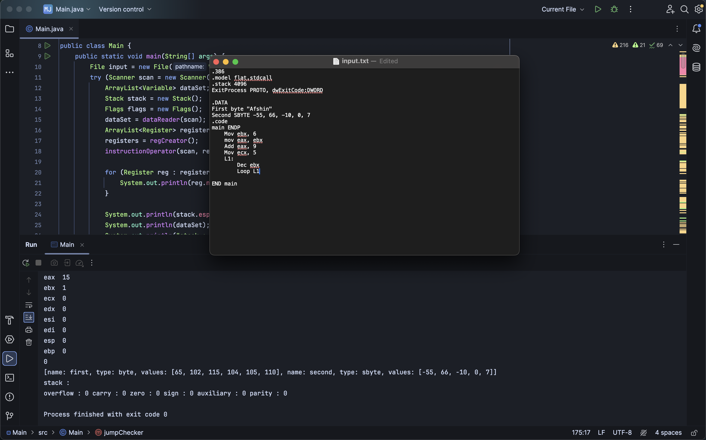
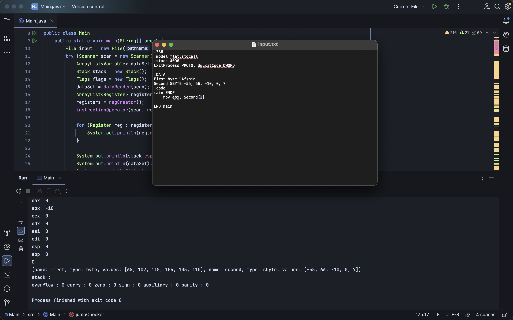

## Fully functional microsoft macro assembler simulator using java

\

- No use of external libraries
- Everything mentioned in the first 6 chapters of the `Assembly Language for x86 processors` by KIP R.IRVINE can be written in this simulator (excluding the 64 bit processors parts)

## Screenshots

\

\

\

\
